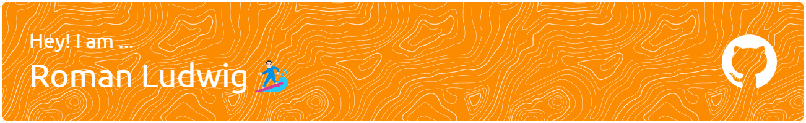

🔭 Working on [probabilistic models](https://github.com/rmnldwg/lymph) to predict how cancer spreads\
👯 Interested in collaborating on [datasets](https://github.com/rmnldwg/lydata) of lymphatic progression patterns in head & neck cancer\
💬 Always happy to hear feedback on our interactive [**Ly**mphatic **Pro**gression e**X**plorer (LyProX)](https://lyprox.org)

# 🌐Socials

# 💻Tech Stack

|     |     |
| --- | --- |
| Writing |    |
| Coding |       |
| Dev |     |
| Software |    |
| Learning |   |

# 📊 GitHub Stats

